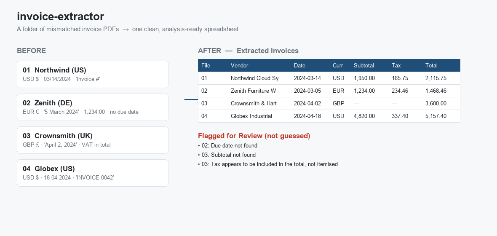

# invoice-extractor

**Turn a folder of mismatched invoice PDFs into one clean, analysis-ready spreadsheet — without ever guessing.**



---

## For clients — what problem does this solve?

Imagine a folder of 200 invoices. Every one looks different: a US supplier writes
dates as `03/14/2024` and prices as `$1,950.00`; a German supplier writes
`5 March 2024` and `1.234,00 €`; a UK firm bundles VAT into the total and never
shows it separately. Someone on your team opens each PDF and retypes the numbers
into Excel by hand. It is slow, mind-numbing, and a single mistyped decimal point
can throw off the books.

**This tool does that data entry automatically.** Point it at the folder and it
produces one tidy spreadsheet — one row per invoice — with the vendor, invoice
number, customer, dates, currency, subtotal, tax, and total, all cleaned up:
dates in a single standard format, amounts as real numbers you can sum.

**The part that matters most:** it never makes things up. If a due date is
missing, a tax amount is rolled into the total, or a number is unreadable, the
tool **leaves that cell blank and adds it to a "Flagged for Review" list with the
reason** — so a person can make the call. You get the speed of automation without
the silent errors. The tool even double-checks its own maths: where subtotal,
tax, and total are all present, it verifies they add up and flags them if they
don't.

**Before:** hours of manual copy-paste, inconsistent formats, hidden typos.
**After:** a clean spreadsheet in seconds, plus a short, honest list of the few
items a human should glance at.

> The sample invoices included in this repository are **fictional**, created only
> to demonstrate the tool. They are not real client data.

---

## For developers

### What it does

Given a folder of **digital (text-based) invoice PDFs**, each with a different
layout, currency, and date format, it extracts a normalised row per invoice and
writes an Excel workbook (or CSV). It handles real-world variation:

| Challenge | Examples it handles |
|---|---|
| Different label wording | `Invoice #`, `Invoice No.`, `REF:`, bare `INVOICE 0042` |
| Many date formats | `03/14/2024`, `18-04-2024`, `5 March 2024`, `April 2, 2024` → all `YYYY-MM-DD` |
| Multiple currencies | `$` / `USD`, `€` / `EUR`, `£` / `GBP`, auto-detected |
| US **and** European numbers | `1,950.00` → `1950.00` and `1.234,56` → `1234.56` |
| Differently-worded totals | `Total`, `Total Due`, `Amount Payable`, `Balance Due` |

### The core principle: flag, never guess

This is the design philosophy of the whole project. Anything missing, unreadable,
or ambiguous is **left blank in the main output** and recorded in a separate
**Flagged for Review** list with a reason and the original text, so a human
decides. On top of that, a **reconciliation check** verifies `subtotal + tax =
total` whenever all three are present and flags any mismatch — a cheap, effective
way to catch extraction errors.

### Output

An `.xlsx` workbook with three sheets:

1. **Extracted Invoices** — the clean table; amounts are real numbers, dates ISO.
2. **Flagged for Review** — `file · field · issue · original text`.
3. **Summary** — invoices processed, fields filled per invoice, how many flagged.

CSV output is also supported (the clean table to your file, the flags to a sibling
`*_flagged.csv`).

### Install

```bash
git clone https://github.com/shura-al-aiid/invoice-extractor-c.git
cd invoice-extractor-c

python -m venv .venv
# Windows:  .venv\Scripts\activate
# macOS/Linux:  source .venv/bin/activate

pip install -r requirements.txt
```

### Usage

```bash
# 1. Generate the fictional sample invoices (zero setup required)
python scripts/generate_samples.py

# 2. Extract them into an Excel workbook
python -m invoice_extractor sample_invoices/ -o output/invoices.xlsx

# CSV instead of Excel
python -m invoice_extractor sample_invoices/ -o output/invoices.csv --format csv

# Full help
python -m invoice_extractor --help
```

Example run:

```text
$ python -m invoice_extractor sample_invoices/ -o output/invoices.xlsx
Processed 4 invoice(s).
  3 item(s) flagged for review across 2 invoice(s).
  output: output/invoices.xlsx
```

The clean table for the bundled samples looks like this:

| Source File | Vendor | Invoice # | Customer | Invoice Date | Due Date | Cur | Subtotal | Tax | Total |
|---|---|---|---|---|---|---|---:|---:|---:|
| 01_northwind… | Northwind Cloud Systems | NW-2024-0118 | Acme Robotics Inc. | 2024-03-14 | 2024-04-13 | USD | 1950.00 | 165.75 | 2115.75 |
| 02_zenith… | Zenith Furniture Works | ZM-00457 | Cafe Lumiere SARL | 2024-03-05 | *(blank)* | EUR | 1234.00 | 234.46 | 1468.46 |
| 03_crownsmith… | Crownsmith & Hart Ltd | CH-1042 | Pembroke Legal LLP | 2024-04-02 | 2024-05-02 | GBP | *(blank)* | *(blank)* | 3600.00 |
| 04_globex… | Globex Industrial Supply | 0042 | Vantage Manufacturing Co. | 2024-04-18 | 2024-05-18 | USD | 4820.00 | 337.40 | 5157.40 |

…and the corresponding **Flagged for Review** entries:

| Source File | Field | Issue |
|---|---|---|
| 02_zenith… | Due date | Due date not found |
| 03_crownsmith… | Subtotal | Subtotal not found |
| 03_crownsmith… | Tax / VAT | Tax appears to be included in the total, not itemised |

Note how invoice 02 (no due date) and invoice 03 (VAT folded into the price)
demonstrate the flagging system rather than producing fabricated values.

### How it works

The pipeline is deliberately small and each stage has one job:

```
PDF ──► extract text ──► locate fields ──► parse & normalise ──► reconcile ──► write
       (pdfplumber)      (label regexes)   (numbers/dates/cur)   (maths check)  (xlsx/csv)
```

1. **Text extraction** (`extractor.extract_text`) reads each page's text with
   `pdfplumber`. An image-only/scanned PDF yields no text and is flagged.
2. **Field location** (`fields.py`) finds each value using broad, label-anchored
   regexes — every match is tied to a label, so the tool never scrapes a random
   number off the page.
3. **Parsing & normalisation** (`parsing/`) converts raw strings to clean values:
   - `numbers.py` — US/EU aware amount parsing.
   - `dates.py` — many formats → ISO `YYYY-MM-DD`.
   - `currency.py` — symbol/code detection, `None` if absent or conflicting.
4. **Reconciliation** (`reconcile.py`) checks `subtotal + tax = total`.
5. **Output** (`output.py`) writes the three-sheet workbook or CSV with real
   numbers and clean formatting.

Throughout, any field that cannot be confidently produced becomes `None` (a blank
cell) plus a `Flag` explaining why — the principle is enforced in one place,
`extractor.extract_invoice`.

### Project structure

```
invoice-extractor-c/
├── invoice_extractor/         # the package
│   ├── __main__.py            # enables `python -m invoice_extractor`
│   ├── cli.py                 # argument parsing & the command-line entry point
│   ├── extractor.py           # orchestrates extraction; enforces flag-never-guess
│   ├── fields.py              # label-anchored regexes that locate each field
│   ├── reconcile.py           # subtotal + tax = total sanity check
│   ├── output.py              # Excel (3 sheets) and CSV writers
│   ├── models.py              # Invoice / Flag / ExtractionResult dataclasses
│   └── parsing/               # pure, unit-tested helpers
│       ├── numbers.py         #   US & European number parsing
│       ├── dates.py           #   date normalisation to ISO
│       └── currency.py        #   currency detection
├── scripts/
│   ├── generate_samples.py    # creates the 4 fictional sample PDFs (reportlab)
│   └── make_preview.py        # regenerates docs/preview.png from real output
├── tests/                     # pytest unit tests for the tricky logic
├── sample_invoices/           # generated demo PDFs
├── output/                    # generated spreadsheets (git-ignored)
└── docs/preview.png           # README before/after image
```

### Running the tests

The tricky logic — the number parser (US and EU), the date normaliser (every
format above), currency detection, and the reconciliation check — is covered by
unit tests:

```bash
pip install -r requirements.txt
pytest
```

### Regenerating the preview image

```bash
python scripts/generate_samples.py   # ensure samples exist
python scripts/make_preview.py       # writes docs/preview.png from the real run
```

---

## Limitations & roadmap

This tool is intentionally honest about its scope:

- **Digital/text-based PDFs only.** It reads the text layer of a PDF. **Scanned
  documents and photographed invoices have no text layer** and will be flagged as
  "no extractable text" rather than silently mis-read. Adding OCR (e.g.
  Tesseract) to handle them is a planned extension.
- **Highly irregular or dense multi-column layouts** (e.g. a customer name split
  across visual columns) can defeat label-anchored regexes. The honest behaviour
  there is to leave the field blank and flag it. A planned, optional
  **AI-assisted extraction step** (an LLM fallback for low-confidence fields)
  would improve recall on these without sacrificing the flag-never-guess
  guarantee — the model's output would still be validated and reconciled, not
  trusted blindly.
- **Ambiguous purely-numeric dates** (e.g. `05/03/2024`) follow a documented
  convention (slash → US month-first, dash/dot → European day-first). A future
  version could infer the convention per-document and flag when confidence is low.
- **`$` is mapped to USD.** Disambiguating `$` between USD/CAD/AUD/etc. is out of
  scope and would itself be a flag-worthy ambiguity in a real deployment.

### A note on the planned AI step (no secrets in the repo)

If/when the optional AI-assisted fallback is added, its API key will be read from
an **environment variable** (e.g. `ANTHROPIC_API_KEY`) and documented — never
hardcoded or committed. There are no API keys, tokens, or credentials anywhere in
this repository.

## License

[MIT](LICENSE) © Hakim Alazif
